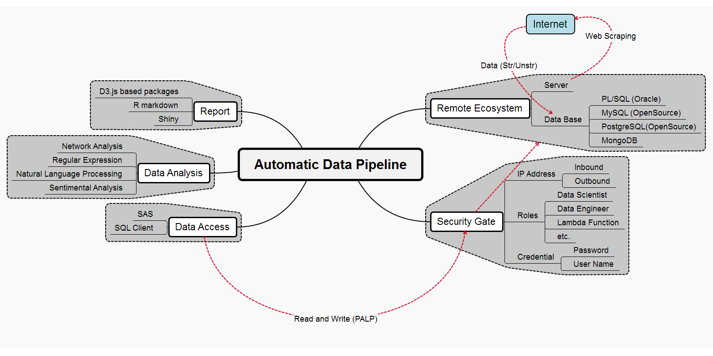

<style>
.footer {
    color: black;
    background: #f2f2f2;
    position: fixed;
    top: 90%;
    text-align:left;
    width:100%;
}

.text {
	color: #000000;
	font-weight:bold;
}

.right {
    text-align: right;
}
</style>


```{r setup, include=FALSE}
knitr::opts_chunk$set(echo = FALSE)
```

<!--
## Face it, this is our world......


## Objective


-->

## What I do?

## Outline

- What?
- Why?
- Where?
- Automatic data pipeline
   - Remote Computing 
   - Security 
   - Data access for data scientist
- Data analysis
- Visualization and Report 
- Cross functional collaboration

## What is Unstructured Data?


## Why?---It is everywhere

- Open government data
- Search engine data
- Services that track social behavior
- Social media data

## Why?---Practical arguments

- Social media is impactful! [Amusing Ourselves to Death: Public Discourse in the Age of Show Business (1985)]
    - "the medium is the message"
    - "the medium is the metaphor"
    - "the form excludes the content"
- Financial resources are sparse
- ... and so is our time
- Reproducibility

<!--
Social media have created a reverberating "echoverse" for brand communication, forming complex feedback loops between the "universe" of corporate communications, news media, and user-generated social media. Prof. William Rand will talk about using computational linguistics techniques to analyze longitudinal unstructured data to understand these feedback loops. He will also talk about building agent-based decision support systems for word-of-mouth programs. 

About the speaker: William Rand, SFI alum and professor of business management at North Carolina State University.
-->

## Where to get the data?

- API: Twitter/Google/Wikipedia...
- Webpage: Forum, Reviews

## API: Trump v.s Clinton Wikipedia View

```{r,message=FALSE}
#data<-read.csv("/Users/happyrabbit/Documents/Hui/Data/Wikipedia/WikiPageView2016_8_2.csv")
#pdat <- xts(data[,c("Trump","Clinton")], order.by=data$Timestamp)
#pdat%>%
#  dygraph() %>%
#  dyOptions(stackedGraph = TRUE) %>%
#  dyRangeSelector()
```


## Summary of packages


## Automatic Data Pipeline





## `#yieldhero`

- When is the best time to tweet
- Who to target
- Product mentioned
- Sentiment score

```{r, echo=FALSE, message=FALSE,warning=FALSE}
library(dplyr)
library(DT)
library(networkD3)
```


## `#yieldhero` Summary Statistics

```{r, echo=F,message=FALSE}
dat <- read.csv("RawData/tweets_yieldhero2016-11-18.csv")
pb.txt <- dat$created
pb.date <- as.POSIXct(pb.txt, tz="GMT")
dat$cdt <- format(pb.date, tz="America/Chicago",usetz=TRUE)

rt1 <- dat%>%filter(isRetweet==T)
rt0 <- dat%>%filter(isRetweet==F)
```

- From 2016-07-28 to 2016-11-18 
- There are `r nrow(dat)` tweets, `r nrow(rt0)` origional tweets  
- Products mentioned > 20 times
    - P1197AM
    - P0157AMX
    - P22T73R
    - P28T08R
 
    
## When is the best time to tweet? 
 
- Total Tweet Counts

```{r}
month <- as.numeric(substr(dat$cdt,6,7))
day <- as.numeric(substr(dat$cdt,9,10))
time<-as.numeric(substr(dat$cdt,12,13))
par(mfrow=c(1,2))
barplot(table(month), main="Counts by Month")
barplot(table(time), main="Counts by Time of the Day (CDT)")
```


## When is the best time to tweet? 

- Tweet and Re-tweet counts by time of the day

```{r, echo=F}
# separate by tweet and re-tweet
month <- as.numeric(substr(rt0$cdt,6,7))
day <- as.numeric(substr(rt0$cdt,9,10))
time<-as.numeric(substr(rt0$cdt,12,13))
par(mfrow=c(1,2))
barplot(table(time), main="Tweet (CDT)")
month <- as.numeric(substr(rt1$cdt,6,7))
day <- as.numeric(substr(rt1$cdt,9,10))
time<-as.numeric(substr(rt1$cdt,12,13))
barplot(table(time), main="Re-tweet (CDT)")
```

## Who to target? 

```{r, echo=FALSE, message=FALSE, warning=FALSE}
#library(RColorBrewer)
library(igraph)
library(network)
library(visNetwork)
#install.packages("ndtv", dependencies=T)
library(ndtv)

nodes <- read.csv("RawData/nodes.csv",stringsAsFactors = F)
links <- read.csv("RawData/links.csv")
nodes$id <- nodes$id-1
#head(nodes)
#head(links)

## re-size the nodes
nodes$size[which(nodes$size==0.1)]<-1
nodes <- cbind(ID=nodes$id,nodes)
nodes <- dplyr::select(nodes, -id)
links <- dplyr::select(links, who_post, who_retweet)
#net <- graph_from_data_frame(d=links, vertices=nodes, directed=T) 
### Preliminary try
#plot(net, edge.arrow.size=.4,vertex.label=NA)
###
sidx<-which(!nodes$state %in% names(sort(table(nodes$state)))[30:32])
state2<-nodes$state
state2[sidx]<-"Others"
nodes$state2<-state2
net <- graph_from_data_frame(d=links, vertices=nodes, directed=T) 
## generate colors based on state
colrs <- c("tomato","gold","blue","gray50")
V(net)$color<- colrs[as.factor(V(net)$state2)]
#levels(as.factor(V(net)$state2))
#degree(net, mode="all")
V(net)$size <- sqrt(nodes$size+10)
V(net)$label <- NA
## change arrow size and edge color
E(net)$arrow.size <- .02
E(net)$edge.color <- "gray80"

l <- layout.fruchterman.reingold(net)
plot(net, layout=l)
legend(x= -1.5, y=-1,c("Manitoba","Minnesota","Nebraska","Others"),
       pt.bg = colrs,pch=21, pt.cex = 1, cex = .8)
```


## Network

```{r,echo=FALSE}
library(networkD3)
forceNetwork(Links = links, Nodes = nodes,
             Source = "who_retweet", Target = "who_post",
             # Value = "value", 
             Nodesize = "size",
             NodeID = "name",
             Group = "state2", 
             fontSize = 16,
             # colourScale = JS("d3.scaleSequential(d3.interpolateRainbow)"),
             legend=T,
             opacity = 1)
```

## Who to target? {.smaller .reduced .text .right}

```{r}
nodes%>%
  dplyr::select(name,size,state)%>%
  datatable(filter = 'top',options = list(
  pageLength = 5, autoWidth = F
))
```

## Products Mentioned

```{r, message=F, echo=FALSE, warning=FALSE}
library(coreNLP)
initCoreNLP()
###############
load("Rcode/Result_files/Yieldhero.RData")
#sentLen<-table(getToken(anno)$sentence)
#hist(sentLen,breaks=30) 
token<-getToken(anno)
dep<-getDependency(anno)
# head(token)
# head(dep,50)
# plot(anno,1)
library(stringr)
library(dplyr)
library(tibble)
# idx=grep("((P){1}(\d)+(\w)+)",token$token)
idx=grep("(^P)[[:digit:]]+",token$token)

dat_prod<- tibble(sentence=token$sentence[idx],
                  PROD_NM=toupper(token$token[idx]))
dat_prod$PROD_NM<-gsub("â","",dat_prod$PROD_NM)
dat_prod$PROD_NM<-gsub("Ã","",dat_prod$PROD_NM)
dat_prod$PROD_NM<-gsub("¢","",dat_prod$PROD_NM)
dat_prod$PROD_NM<-gsub("¢","",dat_prod$PROD_NM)
dat_prod$PROD_NM<-gsub("!","",dat_prod$PROD_NM)
dat_prod$PROD_NM<-gsub(" ","",dat_prod$PROD_NM)
dat_prod$id<-as.numeric(factor(dat_prod$PROD_NM))-1
###########Get all links
lev<-unique(dat_prod$sentence)
# i=52
# j=1
links <- NULL
for (i in lev){
  sdat <- dplyr::filter(dat_prod, sentence==i)
  
  if (nrow(sdat)==1) {
    links <- rbind(links, tibble(prod1=sdat$PROD_NM[1],
                                 prod2=sdat$PROD_NM[1],
                                 id1=sdat$id[1],
                                 id2=sdat$id[1]))
  }
  
  else {
    pairs <- combn(c(1:nrow(sdat)),2)
    d <- ncol(pairs)
    for (j in 1:d) {
      links <- rbind(links, tibble(prod1=sdat$PROD_NM[pairs[1,j]],
                                   prod2=sdat$PROD_NM[pairs[2,j]],
                                   id1=sdat$id[pairs[1,j]],
                                   id2=sdat$id[pairs[2,j]]))
    }
  }
}
###########################
links <- links%>%
  group_by(prod1,prod2,id1,id2)%>%
  summarise(value=length(prod1))%>%
  data.frame()
links$dist <- 1/links$value
links$value2 <- links$value * 10
# str(links)
################# Get notes
notes <- dat_prod%>%
  group_by(PROD_NM,id)%>%
  summarise(size=length(PROD_NM))%>%
  data.frame()
#length(unique(notes$PROD_NM))
notes$group <- cut(notes$size, breaks = c(0,1,10,40,60))
notes$group1 <- rep(1,nrow(notes)) 
#str(notes)
################# 
# Plot
forceNetwork(Links = links, Nodes = notes,
             Source = "id1", Target = "id2",
             Value = "value2", 
             Nodesize = "size",
             NodeID = "PROD_NM",
             Group = "group", 
             fontSize = 16,
             #linkDistance = "dist",
             # linkWidth = "value",
             #colourScale = JS("d3.scaleSequential(d3.interpolateRainbow)"),
             legend=T,
             opacity = 1)
```

## Table of Products

```{r, echo=FALSE}
notes%>%
  dplyr::select(PROD_NM,size)%>%
  dplyr::arrange(desc(size))%>%
  datatable( filter = 'top', options = list(
  pageLength = 7, autoWidth = F
))
```

```{r,echo=FALSE}
pprod <- notes%>%
  filter(size>30)
```

## Is web scraping legal?

- No unambiguous yes or no in any country according to current jurisdiction
- So far, court cases (especially in the US) often dealt with commercial interest and often huge masses of data
    - eBay vs. Bidder's Edge
    - AP vs. Meltwater
    - Facebook vs. Pete Warden 
    - United States vs. Aaron Swartz
    
## Recommendation for your work

- Encrypt sensitive personal identifiable information
- YOU take all the responsibility for your web scraping work
- If you publish data, do not commit copyright fraud
- If in doubt, ask the author/creator/provider of data for permission
- Consult current jurisdiction 

## Trick: robots.txt

- What is robots.txt?

    > "Robots Exclusion Protocol", informal protocol to prohibit web robots from crawling content

- Located in the root directory of a website, e.g. http://baidu.com/robots.txt
- Documents which bot is allowed to crawl which resources (and which not) 
- Not a technical barrier, but a sign that asks for compliance
- Syntax in robots.txt
- Scraping etiquette


##  Data and Code

- All data are available in the package I am developing:

```r
library(devtools)
install_github("happyrabbit/DataScienceR")
library(DataScienceR)
```

- Slides and R code can be found here: 

- http://scientistcafe.com/

"echoverse" for brand communication


## Discussion & Happy Holiday Season!


